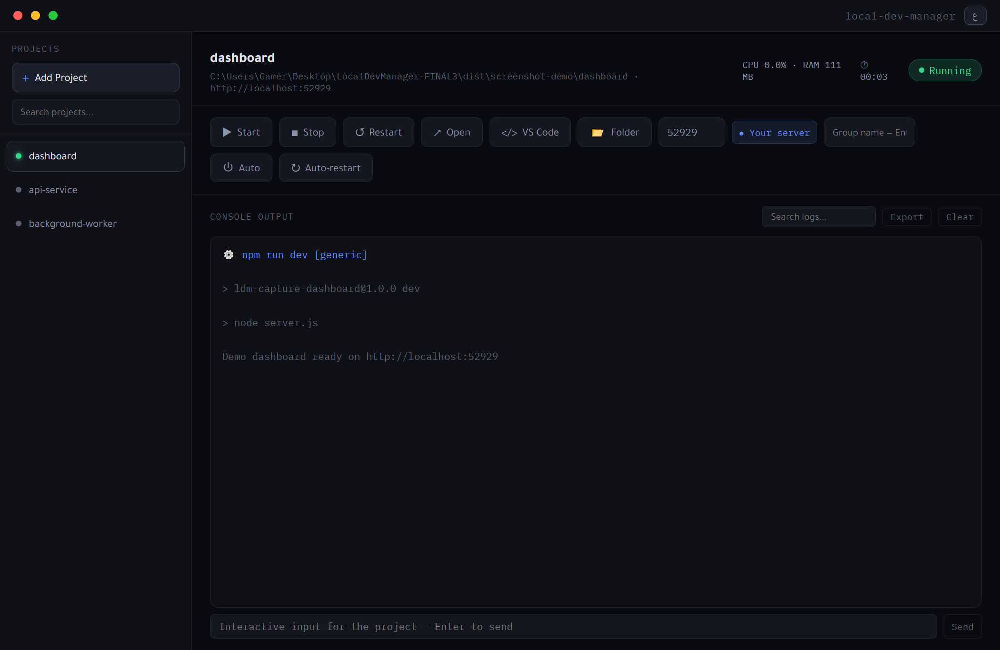

<div align="center" dir="rtl">

[English](README.md) · **العربية** · [简体中文](README.zh-CN.md)

# Local Dev Manager

تطبيق سطح مكتب لإدارة مشاريع تطوير Node.js المحلية وتشغيلها ومراقبتها من مكان واحد.

[تنزيل نسخة Windows](https://github.com/drk0ds-dotcom/local-dev-manager/releases/latest) · [الإبلاغ عن خطأ](https://github.com/drk0ds-dotcom/local-dev-manager/issues/new?template=bug_report.yml) · [المساهمة](CONTRIBUTING.md)

</div>



عندما تعمل على عدة مشاريع محلية، يتيح لك التطبيق تشغيل كل مشروع وإيقافه ومتابعة مخرجاته وإدارة منفذه من واجهة واحدة. يشغّل سكريبت `dev` أو `start` الخاص بالمشروع؛ ليس خدمة استضافة ولا بديلًا عن مدير الحزم.

## البدء السريع

1. نزّل **Local-Dev-Manager-Setup-1.0.0.exe** من [الإصدار v1.0.0](https://github.com/drk0ds-dotcom/local-dev-manager/releases/tag/v1.0.0). النسخة الثنائية المعلنة مخصصة لـ **Windows x64**.
2. ثبّت [Node.js](https://nodejs.org/) وتأكد من توفر `npm` في `PATH`. إذا كان مشروعك يستخدم مدير حزم آخر، ثبّته أيضًا.
3. ثبّت التطبيق، افتحه، واضغط **Add Project / إضافة مشروع**.
4. اختر مجلدًا يحتوي `package.json` صالحًا وسكريبت `dev` أو `start`، ثم اضغط **Start / تشغيل**.

يختار التطبيق منفذًا متاحًا بدءًا من 3000 عند إضافة المشروع. وإذا لم يجد `node_modules`، يشغّل تثبيت الاعتماديات تلقائيًا بمدير الحزم المكتشف. قد ينفّذ التثبيت سكريبتات المشروع؛ أضف مشاريع تثق بها فقط.

## الوظائف الأساسية

| المجال | ما يفعله التطبيق |
| --- | --- |
| دورة حياة المشروع | إضافة مجلدات المشاريع وإزالتها من القائمة، تشغيلها وإيقافها وإعادة تشغيلها، مع خيار التشغيل عند فتح التطبيق وإعادة التشغيل بعد الانهيار. |
| الحزم والأطر | اكتشاف npm أو pnpm أو yarn أو bun؛ اختيار `dev` ثم `start`؛ تمرير المنفذ إلى Vite وNext.js وAngular المعروفة، وإعداد `PORT` و`VITE_PORT`. |
| المنافذ | اختيار منفذ حر، تغييره، عرض حالته، ومنع تشغيل مشروع متوقف على منفذ يشغله برنامج آخر. |
| السجلات | عرض مخرجات كل مشروع، الاحتفاظ بآخر السجلات محليًا، البحث والمسح والتصدير، وإرسال سطر إلى الإدخال القياسي للعملية. |
| مساحة العمل | البحث والتجميع والترتيب بالسحب، وفتح رابط localhost أو مجلد المشروع أو VS Code. |
| سطح المكتب | واجهة عربية/إنجليزية مع RTL، قائمة صينية النظام، عرض CPU والذاكرة، وفحص تحديثات GitHub Releases في النسخة المثبّتة. |

الصور توثّق تجربة يدوية، وليست نتيجة اختبار آلي: [مساحة عمل فارغة](docs/images/empty-state.png)، [مشروع متوقف](docs/images/project-stopped.png)، [مشروع يعمل](docs/images/project-running.png)، [مشروعان يعملان](docs/images/multiple-projects.png)، و[الواجهة العربية](docs/images/arabic-interface.png).

## طريقة العمل المعتادة

```text
اختيار مجلد مشروع Node.js
  ← التحقق من package.json واختيار dev/start
  ← تعيين منفذ متاح
  ← تشغيل المشروع وتثبيت الاعتماديات عند غيابها
  ← متابعة السجلات وفتح localhost
  ← إيقاف المشروع أو إعادة تشغيله عند الحاجة
```

إزالة المشروع تحذفه من قائمة التطبيق وسجلّه المحفوظ فيه، لكنها **لا تحذف مجلد المشروع**. تغيير المنفذ يطبّق عند التشغيل التالي.

## تحذير Windows SmartScreen والتحقق من المثبّت

قد يعرض Windows تحذير SmartScreen لأن هذا المثبّت لا يملك سمعة توقيع برمجي موثوقة بعد. التحذير وحده لا يثبت أن الملف ضار، لكن لا تتجاوز تحذيرًا لملف من مصدر مجهول. نزّل المثبّت من [صفحة الإصدارات الرسمية لهذا المستودع](https://github.com/drk0ds-dotcom/local-dev-manager/releases) فقط، ويمكنك مقارنة SHA-256 مع `SHA256SUMS.txt` المرفق بالإصدار نفسه:

```powershell
Get-FileHash -Algorithm SHA256 '.\Local-Dev-Manager-Setup-1.0.0.exe'
```

لا ندّعي أن المثبّت موثق من Microsoft أو موقّع رقميًا.

## البيانات والخصوصية

يحفظ التطبيق إعدادات المشاريع في `projects.json` داخل مجلد `userData` المحلي الخاص بـ Electron، والسجلات في مجلد `logs` بجواره. يحتفظ في الذاكرة بآخر 500 إدخال لكل مشروع ويضغط السجلات على القرص دوريًا. ينفّذ أوامر داخل مجلدات المشاريع التي تختارها. تفحص النسخة المثبّتة GitHub Releases للتحديثات؛ لا يوجد في المشروع حساب أو مزامنة سحابية. قد تحتوي السجلات على مخرجات أدواتك، فراجعها قبل مشاركتها.

## البنية التقنية

```text
index.html + renderer.js  ↔  preload.js  ↔  main.js  ↔  processManager.js
                                              ├─ projectStarter.js / restartPolicy.js
                                              ├─ projects.json والسجلات في userData
                                              └─ عمليات npm/pnpm/yarn/bun
```

تدير عملية Electron الرئيسية التخزين المحلي والحوارات والعمليات وصينية النظام. تعرض `renderer.js` الواجهة وتتواصل عبر API محدود في `preload.js`، مع تعطيل Node integration وتفعيل context isolation. يتولى `processManager.js` تشغيل المشاريع ومراقبتها، ويفحص `projectStarter.js` البيئة والمنفذ قبل التشغيل، بينما يحد `restartPolicy.js` محاولات الإعادة بعد الانهيار. التقنيات: Electron 33، JavaScript، `cross-spawn`، `pidusage`، `electron-updater`، وelectron-builder/NSIS.

## التطوير من المصدر

تحتاج Node.js وnpm وبيئة تطوير Windows. ثُبّتت نسخ الاعتماديات في `package-lock.json`.

```powershell
npm ci
npm test
npm start
```

لبناء المثبّت محليًا: `npm run dist`. يشغّل CI على Windows تثبيت الاعتماديات والاختبارات وفحص صياغة JavaScript؛ ولا ينشر الإصدارات تلقائيًا. لفهم الكود ابدأ بـ [`main.js`](main.js) و[`preload.js`](preload.js) و[`processManager.js`](processManager.js) و[`renderer.js`](renderer.js) و[`projectStarter.js`](projectStarter.js). حفظنا سجل التطوير السابق في [docs/DEVELOPMENT_HISTORY.ar.md](docs/DEVELOPMENT_HISTORY.ar.md).

## الحدود المعروفة

- المثبّت والاختبارات الآلية المعلنة تخص Windows x64. لم تُتحقق حزم macOS وLinux للإصدار v1.0.0.
- واجهة التطبيق بالعربية والإنجليزية؛ الصينية متاحة للتوثيق فقط.
- يحتاج المشروع إلى `package.json` وسكريبت `dev` أو `start`، ولا يدير مشاريع غير Node.js حاليًا.
- يعتمد استخدام المنفذ المحدد على احترام السكريبت أو الإطار لـ `--port` أو `PORT` أو `VITE_PORT`.
- ينفّذ تثبيت الاعتماديات وسكريبتات المشروع كودًا محليًا؛ راجعها قبل التشغيل.

## المجتمع والترخيص

راجع [دليل المساهمة](CONTRIBUTING.md) و[سياسة الأمان](SECURITY.md) و[قواعد السلوك](CODE_OF_CONDUCT.md) و[سجل الإصدارات](CHANGELOG.md). المشروع متاح وفق [رخصة MIT](LICENSE)، Copyright (c) 2026 Burayk.
