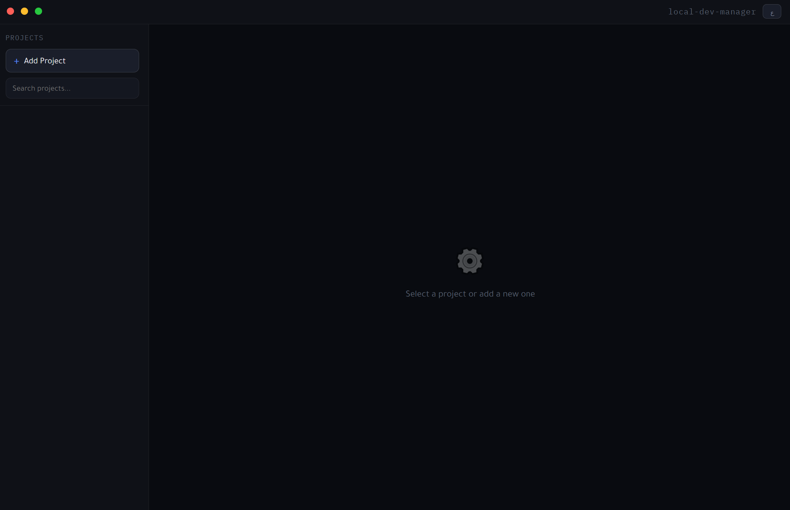
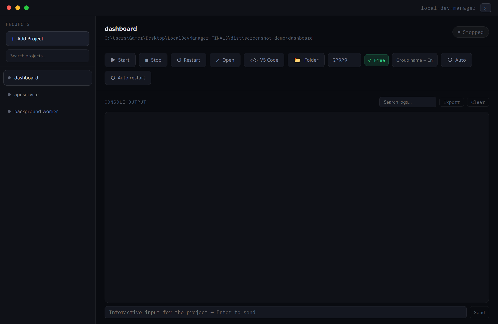
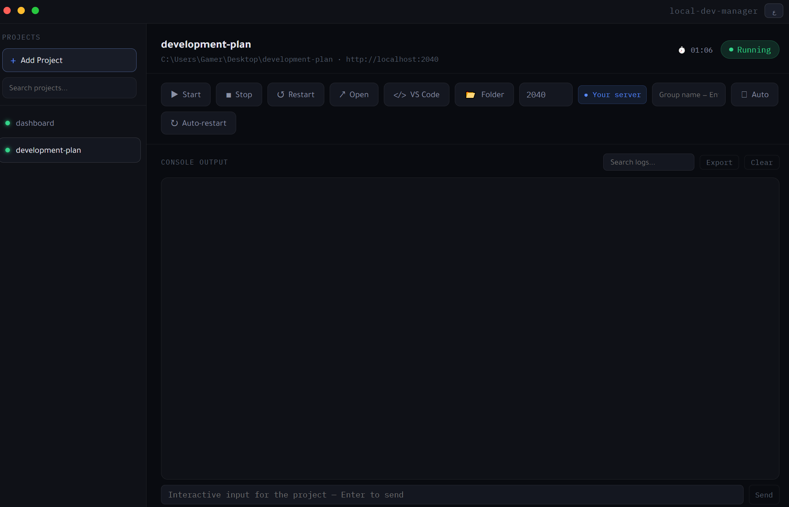
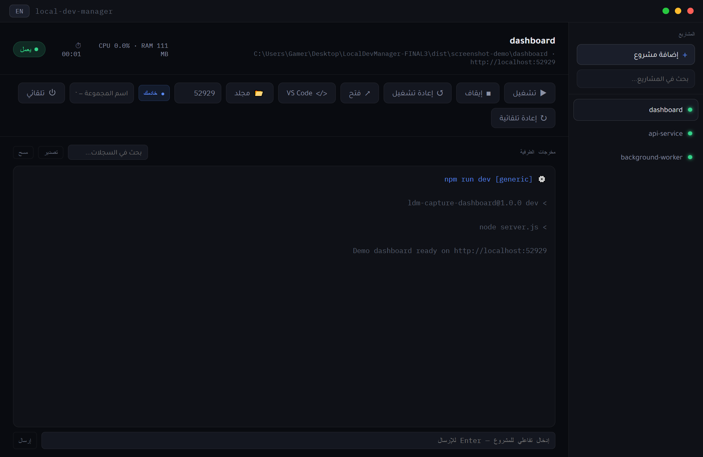

<div align="center">

[English](README.md) · [العربية](README.ar.md) · **简体中文**

# Local Dev Manager

在一个 Windows 桌面应用中管理本地 Node.js 项目和可信的自定义命令。

[下载 Windows 版本](https://github.com/drk0ds-dotcom/local-dev-manager/releases/latest) · [报告问题](https://github.com/drk0ds-dotcom/local-dev-manager/issues/new?template=bug_report.yml) · [参与贡献](CONTRIBUTING.md)

</div>


如果你同时开发多个本地项目，可以在一个界面中启动、停止、查看输出、管理端口并打开开发服务器。应用运行 Node.js 项目自身的 `dev` 或 `start` 脚本，也可以运行其他本地项目的可信自定义命令；它不是托管服务，也不替代运行环境或包管理器。

**修订版 v1.0.0 安装包：**当前下载文件同时支持 Node.js 项目和可信自定义命令。如果你已安装较早的 `1.0.0` 构建，请下载修订版并手动重新安装；应用内更新器不会把相同版本号的不同构建识别为新版本。`v1.0.0` 标签和 GitHub 自动生成的源码压缩包仍对应最初的发布版本；修订版源码位于 `main` 分支。

## 快速开始

1. 从 [v1.0.0 发布页](https://github.com/drk0ds-dotcom/local-dev-manager/releases/tag/v1.0.0) 下载 **Local-Dev-Manager-Setup-1.0.0.exe**。本次二进制发布面向 **Windows x64**。
2. 对于 Node.js 项目，请安装 [Node.js](https://nodejs.org/) 并确保 `npm` 位于 `PATH`。如果项目需要其他包管理器或运行环境，也请单独安装。
3. 安装并打开应用，点击 **Add Project**。
4. 对于 Node.js 项目，选择包含有效 `package.json` 且定义了 `dev` 或 `start` 脚本的文件夹。对于其他本地项目，选择 **Custom command** 并输入可信命令。确认设置后点击 **Start**。

添加项目时，应用从 3000 开始选择可用端口。如果缺少 `node_modules`，会使用检测到的包管理器自动安装依赖。安装可能执行项目脚本，因此只添加可信项目。

## 主要功能

| 范围         | 实际功能                                                                                                                                                                   |
| ------------ | -------------------------------------------------------------------------------------------------------------------------------------------------------------------------- |
| 项目生命周期 | 添加或从列表移除本地项目，启动、停止、重启；可选择打开应用时自动启动，以及崩溃后自动重启。                                                                                 |
| 自定义命令   | 选择本地文件夹并输入 `python worker.py` 或 `go run .` 等可信命令；端口可选，所需运行环境必须单独安装。                                                                     |
| 包管理与框架 | 根据 `packageManager` 字段或锁文件识别 npm、pnpm、yarn、bun；优先运行 `dev`，否则运行 `start`；对识别的 Vite、Next.js 和 Angular 脚本传递端口，并设置 `PORT`/`VITE_PORT`。 |
| 端口         | 分配空闲端口、修改端口、显示占用状态，并阻止已停止的项目使用被其他进程占用的端口启动。                                                                                     |
| 输出         | 分项目查看输出，在本地保留最近日志，搜索、清空或导出日志，向运行中的项目发送一行标准输入。                                                                                 |
| 工作区       | 搜索、分组、拖动排序，打开本地网址、项目文件夹或 VS Code。                                                                                                                 |
| 桌面集成     | 英语和阿拉伯语界面及 RTL 布局；系统托盘；运行进程树的 CPU/内存轮询；已打包应用通过 GitHub Releases 检查更新。                                                              |

## 应用截图

截图展示的是人工操作，不代表自动化测试结果。运行中项目的截图位于页面顶部；点击下方图片可查看原图。

| 空白工作区                                                                                  | 已停止的项目                                                                                            |
| ------------------------------------------------------------------------------------------- | ------------------------------------------------------------------------------------------------------- |
| [](docs/images/empty-state.png) | [](docs/images/project-stopped.png) |

| 两个运行中的项目                                                                                                | 阿拉伯语界面                                                                                            |
| --------------------------------------------------------------------------------------------------------------- | ------------------------------------------------------------------------------------------------------- |
| [](docs/images/multiple-projects.png) | [](docs/images/arabic-interface.png) |

## 常见流程

```text
选择 Node.js 项目文件夹
  → 验证 package.json 并选择 dev/start
  → 分配可用端口
  → 启动项目；缺少依赖时先安装
  → 查看输出并打开 localhost
  → 按需停止或重启
```

从应用中移除项目会删除列表条目及其应用日志，**不会删除项目文件夹**。修改端口会在下次启动时生效。

## 自定义命令

点击 **Add Project**，选择本地文件夹，再选择 **Custom command**。输入可信命令，例如 `python worker.py` 或 `go run .`。后台任务可以不填写端口；HTTP 服务则应填写实际监听的端口。应用会通过 Windows shell，以当前账户权限执行该命令，因此只应使用可信的命令和目录。应用不会为自定义项目自动安装依赖；请自行安装 Python、Go 或其他所需运行时，并确保命令可在 `PATH` 中找到它（或使用可执行文件的完整路径）。无端口时，**Running** 只表示子进程仍在运行，不表示存在 HTTP 服务，**Open** 按钮不可用；有端口时，只有成功连接该端口才显示运行状态。日志、标准输入、停止和重启操作与 Node.js 项目共用。修改命令或端口会在下次启动时生效；设置保存在本地 `userData`。

## Windows SmartScreen 与安装包校验

由于安装包尚无成熟的可信代码签名信誉，Windows SmartScreen 可能显示警告。警告本身不能证明文件有害，但请勿绕过来自未知来源文件的警告。仅从本仓库的[官方 GitHub Releases](https://github.com/drk0ds-dotcom/local-dev-manager/releases)下载；如需额外校验，可将 SHA-256 与同一发布页的 `SHA256SUMS.txt` 对照：

```powershell
Get-FileHash -Algorithm SHA256 '.\Local-Dev-Manager-Setup-1.0.0.exe'
```

我们不声称安装包已经获得 Microsoft 认证或代码签名。

## 数据与隐私

项目设置保存在 Electron 本地 `userData` 目录中的 `projects.json`，日志位于其 `logs` 子目录。应用在内存中为每个项目保留最近 500 条记录，并定期压缩磁盘日志。命令只在你选择的本地项目文件夹中运行。已安装版本会检查 GitHub Releases 更新，但下载和安装前会分别征求同意；项目中没有账户或云同步服务。Tajawal 和 IBM Plex Mono 字体随应用本地提供，打开界面不会向 Google Fonts 请求字体。导出日志前请检查其中是否包含开发工具输出的敏感信息。

## 技术结构

```text
index.html + renderer.js  ↔  preload.js  ↔  main.js  ↔  processManager.js
                                              ├─ projectStarter.js / restartPolicy.js
                                              ├─ userData 中的项目设置和日志
                                              └─ npm/pnpm/yarn/bun 脚本或可信的自定义命令
```

Electron 主进程负责本地数据、对话框、进程控制和系统托盘。`renderer.js` 负责界面，经 `preload.js` 提供的受限 IPC API 通信；Node integration 已关闭，context isolation 已开启。`processManager.js` 负责启动和监控进程，`projectStarter.js` 在启动前检查环境和端口，`restartPolicy.js` 限制崩溃重试。当前源码使用 Electron 44、JavaScript、`cross-spawn`、`pidusage`、`electron-updater` 与 electron-builder/NSIS。

## 从源码开发

需要 Node.js、npm 和 Windows 开发环境。依赖版本记录在 `package-lock.json` 中。

```powershell
npm ci
npm test
npm start
```

`LocalDevManager.bat` 和 `LocalDevManager.vbs` 仅供在源码目录执行 `npm ci` 后于 Windows 上启动 `npm start`；`.vbs` 会隐藏命令窗口。它们不是安装包。普通安装请使用上方发布页中的 `.exe`。

运行 `npm run dist` 可在本地构建 Windows 安装包。Windows CI 执行依赖安装、测试、ESLint 检查和格式检查，不会自动发布。阅读源码可从 [`main.js`](main.js)、[`preload.js`](preload.js)、[`processManager.js`](processManager.js)、[`renderer.js`](renderer.js) 和 [`projectStarter.js`](projectStarter.js) 开始。

## 已知限制

- 已发布安装包和自动化验证针对 Windows x64；v1.0.0 尚未验证 macOS 或 Linux 安装包。
- 应用界面提供英语和阿拉伯语；简体中文仅用于此文档。
- 修订版 `v1.0.0` 安装包支持自定义命令。Python 3.14 工作进程、Flask、Uvicorn、HTTP 服务以及真实 Go HTTP 服务已在本地验证。Go 测试使用临时便携版运行时，没有在系统中安装 Go。较早安装的同版本构建需要手动重新安装。
- 指定端口能否生效取决于项目脚本或框架是否读取 `--port`、`PORT` 或 `VITE_PORT`。
- 自动安装依赖及项目脚本会执行本地代码，运行前请检查项目内容。

## 社区与许可

参阅[贡献指南](CONTRIBUTING.md)、[安全政策](SECURITY.md)、[行为准则](CODE_OF_CONDUCT.md)和[更新记录](CHANGELOG.md)。项目采用 [MIT 许可证](LICENSE)，Copyright (c) 2026 Burayk。
